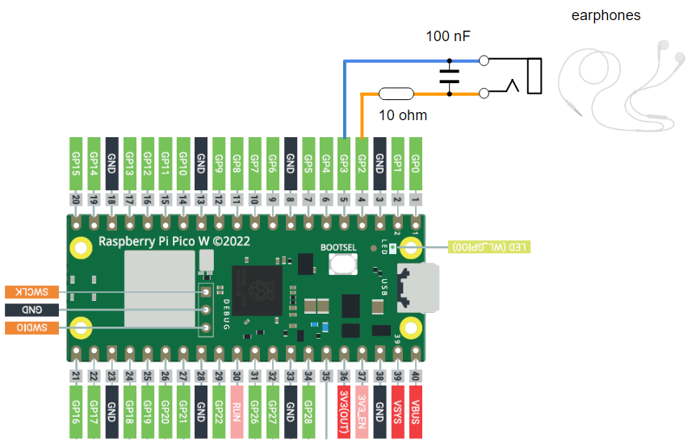
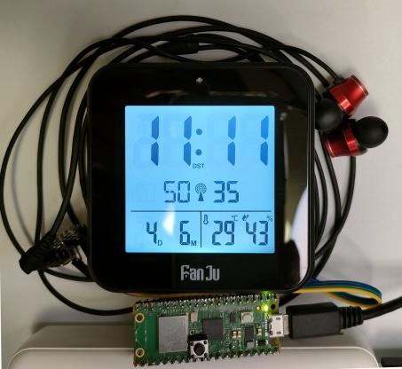

# DCF77 transmitter for Raspberry Pi Pico W

## Overview
This project is DCF77 transmitter for Raspberry Pi Pico W in proximate usage

This project supports:
* fetch CET (CEST) time by NTP
* DCF77 carrier frequency at 77500 Hz
* DCF77 amplitude modulation (High: 100%, Low: 12.5%)
* DCF77 phase modulation (0°, +15.6°, -15.6°) (Implemented, not verified yet)
* minimum peripheral circuits with wired headphones to emit weak radio waves

## Supported Board
* Raspberry Pi Pico W

## Pin Assignment

| Pico Pin # | Pin Name | Function | Note |
----|----|----|----
|  4 | GP2 | PIN_MOD_P | DCF77 signal differential output Pch |
|  5 | GP3 | PIN_MOD_N | DCF77 signal differential output Nch |

* Single-ended signal is not available since pair signals are asymmetrically driven in actual to have effect of PWM. Use a transformer to convert into single-ended output.

## Connection Diagram


## How to make the program work
* Use [Thonny](https://thonny.org/) (Confirmed with Thonny 4.0.2, Python 3.10.9)
* Install MicroPython (Raspberry Pi Pico) interpreter firmware on Raspberry Pi Pico W by Thonny
* Confirmed with MicroPython v1.22.2
* Add `secrets.py` to include your WiFi configuration and put it on the storage of Raspberry Pi Pico W
```
# secrets.py
secrets = {
  'ssid': 'xxxx',
  'password': 'xxxx',
}
```
* Excecute `pico_dcf77_tx.py` from Thonny
* For stand-alone application, please rename `pico_dcf77_tx.py` as `main.py` and store in the storage of Raspberry Pi Pico W

## Log
Bit description log displayed in the console is made compliant to https://www.dcf77logs.de/live except for Civil warning bits / weather information
```
Timecode: Sat, Jun 03, 2023 21:17:00  0-000000000000000-001001-11101000-1000010-110000-011-01100-110001001
```

## Tips for emitting DCF77
* The recommended way to make the clock detect DCF77 emulated singal in limited proximate environment, is just to connect wired earphone between PIN_MOD_P and PIN_MOD_N pins through designated circuit (LPF) and put the clock close to the earphone cable. (This could damage the earphone. please try with cheaper one.)

